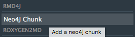
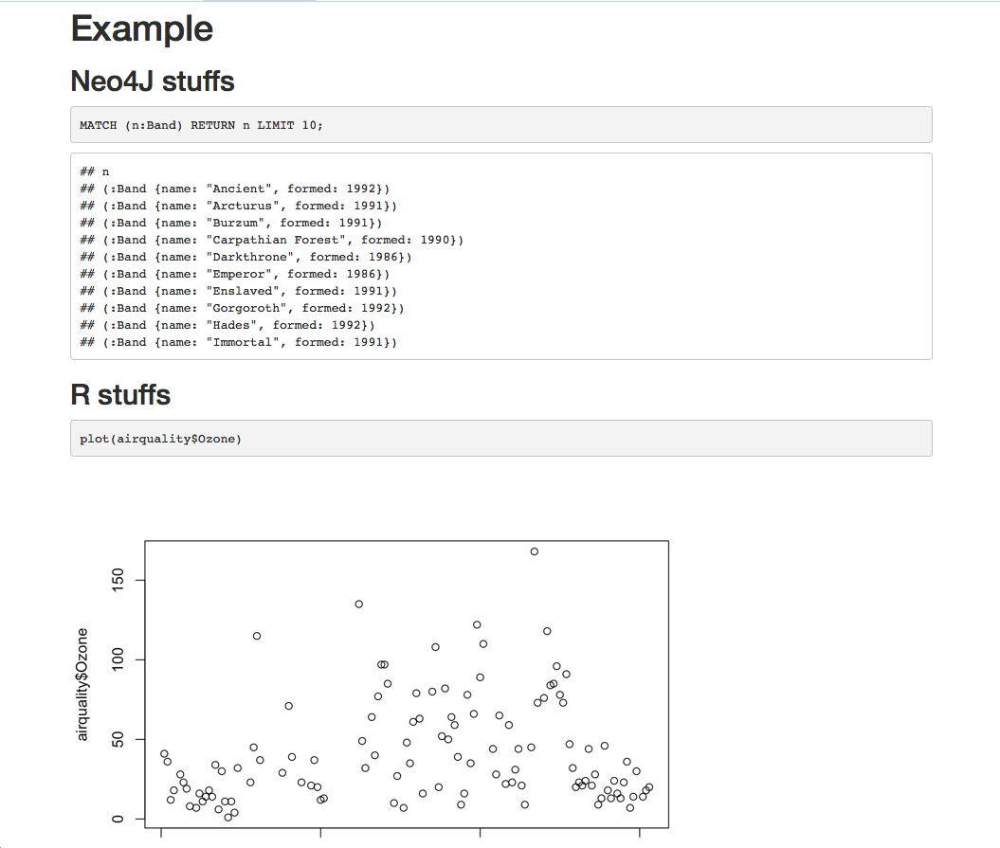

<!-- README.md is generated from README.Rmd. Please edit that file -->

```{r setup, include = FALSE}
knitr::opts_chunk$set(
  collapse = TRUE,
  comment = "#>",
  fig.path = "man/figures/README-",
  out.width = "100%"
)
```

[](https://www.tidyverse.org/lifecycle/#experimental)

> Disclaimer: this package is still at an experimental level, and should only be used for testing, bug reports, and enhancement requests. 

This package has only been tested on these platforms for now, with the files found in `inst/examples`, so it might not work on others : 

- neo4j 3.3.3

  + Mac OSX

- neo4j 3.4.0-alpha08

  + Linux Mint

  + Windows 10

# rmd4j

The goal of {rmd4j} is to provide a knitr engine for running Neo4J inside an RMarkdown

## Installation

You can install rmd4j from GitHub with:

```{r gh-installation, eval = FALSE}
# install.packages("remotes")
remotes::install_github("ThinkR-open/rmd4j")
```

## Before using 

You need to have downloaded the neo4j [community edition](https://neo4j.com/download/other-releases/), and have unpacked it. 

In order to use this knitr engine, you must have a running connection to a Neo4J server, launched with `$NEO4J_HOME/bin/neo4j start` ($NEO4J_HOME being the folder you've unpacked neo4j into).

Note to Windows users: you might need to specify your path with `\\`, like `C:\\USers\\colin\\Documents\\neo4j`.

## Test the package

If you want to test the package before using, there are three .Rmd inside the inst/examples folder that can be use for playing around.

Add the path to you Neo4J home directory, and test. 

Any feedback is welcome!

## Example

You can start a new document by using the RMarkdown template which comes with the package. This Rmd comes with the configuration chunk. 

If you want to add a Neo4J engine to an existing Rmarkdown, add the `set_neo4j_engine` function inside the `setup` chunk in your RMarkdown. 

If you follow the advices below about username and password, this should only be something like : 

```{r, eval = FALSE}
rmd4j::set_neo4j_engine(neo4j_home = "/Users/colin/soft/graphs/n4j")
```

But with more customisation:

```{r, eval = FALSE}
rmd4j::set_neo4j_engine(neo4j_home = "/Users/colin/soft/graphs/n4j", 
                        neo4j_user = "colin", 
                        neo4j_passwd = "pouetpouet", 
                        neo4j_adress = "bolt://localhost:7687")
```

You can set: 

+ `neo4j_home` the path to your Neo4J home directory
+ `neo4j_user` your Neo4J username
+ `neo4j_passwd` your Neo4J username
+ `neo4j_format` the format of the output (either auto, verbose, or plain, default is "plain")
+ `neo4j_adress` the url of the server, default is "bolt://localhost:7687"

As this chunk might contain some sensible information (like you password), don't forget to `{r setup, include=FALSE}` this chunk. 

## The chunks 

Neo4J chunks should start with a ````{neo4j}`. 

You can run several Neo4J calls in the same chunk. 

> Please not that for now, comments are not supported (but we're working on it) <https://github.com/ThinkR-open/rmd4j/issues/4> 

{rmd4j} comes with an addin to add a chunk : 



## About passwords and username

If you don't specify any `neo4j_user` and `neo4j_passwd`, `set_neo4J_engine()` will not use the `--user` and `--password` args of the cypher-shell. 

In that case, you'll need to have provided Neo4J your user name and password, or have disabled the password request (see below). 

We strongly recommand to provide your Neo4J password outside of the Rmd, as it will prevent any unwanted share of these credentials. 

### Disable Neo4J password request 

Go to `$NEO4J_HOME/conf/neo4j.conf` and uncomment the line : `dbms.security.auth_enabled=true`


### Create aliases (recommanded)

Add to your bash profile: 

```
export NEO4J_USERNAME='yourusername'
export NEO4J_PASSWORD='yourpassword'
```

Via : [Neo4J Knowledge base](https://neo4j.com/developer/kb/how-do-i-authenticate-with-cypher-shell-without-specifying-the-username-and-password-on-the-command-line/)

## Output 

You can mix any other content (including R, of course), inside your Rmarkdown : 



## Example 

### Using github_document as output : 

From [Rmd](https://github.com/ColinFay/neo4Jplayground/blob/master/colintracks.Rmd) to [md](https://github.com/ColinFay/neo4Jplayground/blob/master/colintracks.md). 

## Contact

Questions and feedbacks [welcome](mailto:colin@thinkr.fr)!

You want to contribute ? Open a [PR](https://github.com/thinkr/rmd4j/pulls) :) If you encounter a bug or want to suggest an enhancement, please [open an issue](https://github.com/thinkr/rmd4j/issues).


  Please note that this project is released with a [Contributor Code of Conduct](CODE_OF_CONDUCT.md).
  By participating in this project you agree to abide by its terms.
